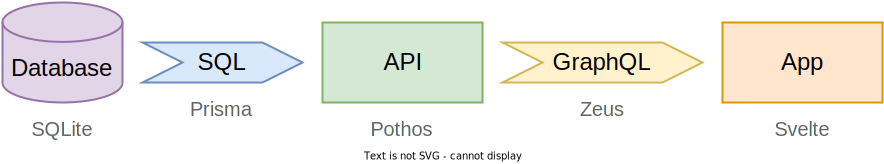
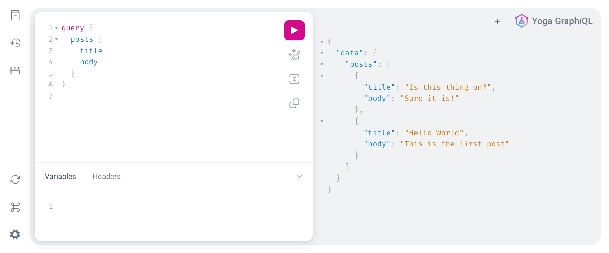
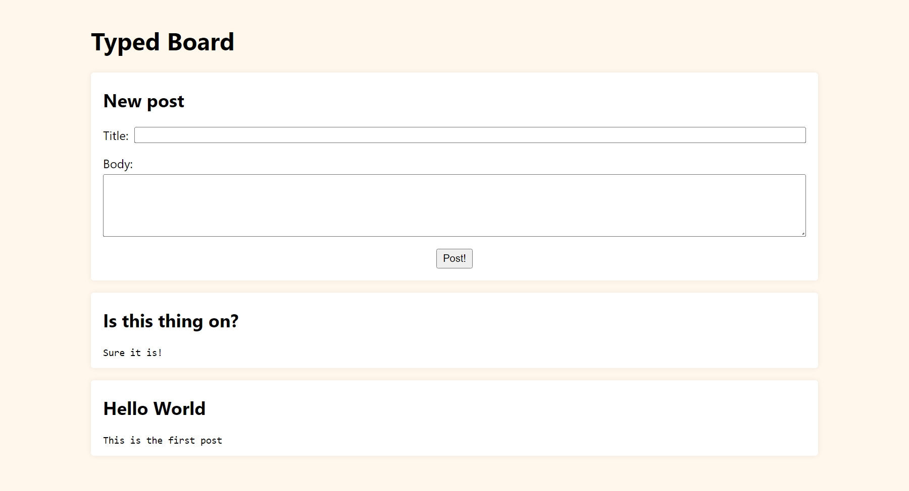

# Achieving end-to-end type safety in a modern JS GraphQL stack

In this article, we will create a simple GraphQL application, a message board, by combining many recent open-source technologies. This article aims to be a showcase of technologies that work well together rather than a complete tutorial on project setup. **It is however a long read, so I recommend settling in with a cup of coffee, a comfortable chair, and a terminal.**

## What is _end-to-end_ type safety?

Type safety is the property of a program that guarantees that all value types are known at build time. It prevents a lot of bugs from happening before running the program. The most common way to achieve type safety in a JavaScript project is to use TypeScript:

```ts
// Declare an object shape:
interface User {
  name: string;
  email: string;
}

const sendMail = (user: User) => {};

// This works:
sendMail({ name: "John", email: "john@example.com" });

// This doesn't:
sendMail("john@example.com");
// (x) Argument of type 'string' is not assignable to parameter of type 'User'.
```

When using TypeScript in a project, you get type safety in this very project. **End-to-end type safety, on the contrary, is achieved when several projects interact together (e.g., with an API) in a type-safe way.**

We will build a message board relying only on type-safe technologies: TypeScript for the API and the application, GraphQL as a way to interact between them, and a SQLite database.

## Data and type flows

The data flow of an application is the way data travels and is transformed throughout the application. It is usually represented by a directed graph like this one:



Since data has a type, **there also exists a type flow, which is the path of types through said application.**

Here, our data flows from left to right, with the database as the data source. Our types follow the same path, with the database schema as the source of types. This is why I prefer code-first over schema-first GraphQL APIs: the data and type flows overlap.

I annotated the diagram with the technologies we will use in this article, and we will set up these technologies from left to right too.

## Project setup

If you want to have everything working by the end of this article, you can follow the steps below. Otherwise, you can skip to the next section.

If you don't have Node or Yarn on your machine, you can install them easily with [Volta](https://volta.sh/):

```bash
# Install the latest versions of Node and Yarn
volta install node@latest
volta install yarn@latest

# Create a new project
mkdir typed-board && cd $_

# Setup a monorepo with Yarn 4
yarn init --private --workspace -2
yarn set version canary

# Enable the good ol' node_modules
echo 'nodeLinker: node-modules' >> .yarnrc.yml
echo 'node_modules/\nbuild/' >> .gitignore
```

We use Yarn 4 because it ships with a few tools to manage monorepos that we will use later.

[_Read more about monorepo tooling_](https://escape.tech/blog/p/4828adcc-f3b2-4c33-8882-411a35902fdb/)

## Prisma

[Prisma](https://www.prisma.io/) is an ORM for Node.js and TypeScript, focused on developer experience. Among all of its features, Prisma offers a top-notch type-safe database client.

```bash
# Create a new package for the GraphQL API
mkdir -p packages/api && cd $_

# Initialize a new project
yarn init --private

# Install a few dependencies to get going
yarn add --dev typescript @types/node tsx @tsconfig/node18-strictest-esm prisma
yarn add @prisma/client
```

The last command installs the following tools:

- [TypeScript](https://www.typescriptlang.org/), to check that our code is type-safe, and [type definitions for Node.js](https://www.npmjs.com/package/@types/node);
- [TSX](https://github.com/esbuild-kit/tsx), to run TypeScript without compiling the code;
- A [`tsconfig.json` preset](https://github.com/tsconfig/bases/blob/main/bases/node18-strictest-esm.combined.json) that ensures type safety;
- [Prisma](https://www.prisma.io/), to interact with the database.

```bash
# Bootstrap a Prisma project
yarn prisma init --datasource-provider sqlite
```

This command creates a few files, but the most interesting one is `prisma/schema.prisma`. Prisma offers to describe a database through a schema file: we will use this file to have Prisma create the tables for us.

<!-- TODO: change to js for dev.to -->

```prisma
generator client {
  provider = "prisma-client-js"
}

datasource db {
  provider = "sqlite"
  url      = env("DATABASE_URL")
}

// Let's declare a Post table
model Post {
  id    Int    @id @default(autoincrement())
  title String
  body  String
}
```

This `model` declares that we want a `Post` table with three columns. Our database doesn't exist yet, so let's create it:

```bash
# Make prisma create a database conforming to the schema
yarn prisma db push

# Ignore the SQLite database
echo 'dev.db' >> .gitignore
```

Everything is up and running! Prisma created a SQLite database for us in `packages/api/prisma/dev.db`.

Let's try to interact with it; create a file named `packages/api/src/index.ts` with the following code:

```ts
import { PrismaClient } from "@prisma/client";

const prisma = new PrismaClient();

// Insert a new post
await prisma.post.create({
  data: {
    title: "Hello World",
    body: "This is the first post",
  },
});

// Print all posts
console.log(await prisma.post.findMany());
```

To run this code, we will need to complete the project setup:

### 1. Create a `tsconfig.json` file in `packages/api`

Let's make use of the preset we installed earlier:

```jsonc
{
  "extends": "@tsconfig/node18-strictest-esm/tsconfig.json",
  "compilerOptions": {
    "exactOptionalPropertyTypes": false,
    "outDir": "./build"
  }
}
```

### 2. Update the `package.json`

The following lines tell Node.js that we write [ECMAScript modules](https://nodejs.org/api/esm.html#introduction) rather than CommonJS modules. In other words, we will use `import` rather than `require()`. We also define two package scripts to make our lives easier.

```jsonc
{
  "name": "api",
  "dependencies": {
    "@prisma/client": "^4.4.0"
  },
  "devDependencies": {
    "@tsconfig/node18-strictest-esm": "^1.0.1",
    "prisma": "^4.4.0",
    "tsx": "^3.9.0",
    "typescript": "^4.8.4"
  },
  "packageManager": "yarn@4.0.0-rc.22",
  "private": true,
  // Add the following lines: (without this comment)
  "scripts": {
    "build": "tsc",
    "dev": "tsx watch --clear-screen=false src/index.ts"
  },
  "type": "module"
}
```

### 3. Fasten your seatbelt – _we're ready for takeoff_

```bash
# Type-check and build the package
yarn build

# Run the code in watch mode (every time you save a file, it will be re-run)
yarn dev
```

You should see your first post printed in the console. **Hello World!**

Prisma types all the arguments and return values, allowing **TypeScript to catch typos and provide relevant autocompletion.** You can ensure that TypeScript does its job by removing the title or body of the `post.create` call and then run `yarn build` in the directory; you should see something like this:

```console
src/index.ts:7:3 - error TS2322:
  ...
    Property 'title' is missing in type '{ body: string; }' but required in type 'PostCreateInput'.
```

We're done with the database part; let's move on to the backend.

## Pothos

[Pothos](https://pothos-graphql.dev/) is a breeze of fresh air when it comes to building GraphQL APIs. It is a library that lets you write code-first GraphQL APIs with an emphasize on _pluggability_ and type safety. **And it has an awesome Prisma integration!** (I am genuinely excited about this one, it makes my life so much easier.)

We will add a GraphQL API on top of our database, with a query to get articles and a mutation to create a new one.

Let's install Pothos and [Yoga](https://www.the-guild.dev/graphql/yoga-server) in the `packages/api` directory:

```bash
# Install Pothos, Yoga and GraphQL Armor
yarn add @pothos/core @pothos/plugin-prisma graphql graphql-yoga@three @escape.tech/graphql-armor

# Setup the Prisma-Pothos integration
echo 'generator pothos {\nprovider = "prisma-pothos-types"\n}' >> prisma/schema.prisma
yarn prisma generate
```

And let's also create a few files to define a simple GraphQL API:

### `src/schema.ts`

This file will contain our queries and mutations. It's a good practice to split the schema file into several files to allow it to scale, the [Pothos documentation has a dedicated section](https://pothos-graphql.dev/docs/guide/app-layout) about it, but we will keep it simple for now.

```ts
import SchemaBuilder from "@pothos/core";
import PrismaPlugin from "@pothos/plugin-prisma";
import type PrismaTypes from "@pothos/plugin-prisma/generated";
import { PrismaClient } from "@prisma/client";
import { printSchema } from "graphql";
import { writeFile } from "node:fs/promises";

// Instantiate the Prisma client
const prisma = new PrismaClient();

// Instantiate the schema builder with the Prisma plugin
const builder = new SchemaBuilder<{ PrismaTypes: PrismaTypes }>({
  plugins: [PrismaPlugin],
  prisma: { client: prisma },
});

// Declare a `Post` GraphQL type, based on the table of the same name
const PostType = builder.prismaObject("Post", {
  fields: (t) => ({
    // Expose only the underlying data we want to expose
    id: t.exposeID("id"),
    title: t.exposeString("title"),
    body: t.exposeString("body"),
  }),
});

builder.queryType({
  fields: (t) => ({
    // Declare a new query field, `posts`, which returns the latest posts
    posts: t.prismaField({
      // Pothos makes sure that `type` and `resolve` are of the same type
      type: [PostType],
      resolve: async (query) =>
        // Return the 10 latest posts
        prisma.post.findMany({ ...query, orderBy: { id: "desc" }, take: 10 }),
    }),
  }),
});

builder.mutationType({
  fields: (t) => ({
    // Declare a new mutation field, `createPost`, which creates a new post
    createPost: t.prismaField({
      type: PostType,
      // The mutation takes a `title` and `body` arguments
      // They are correctly typed as string in `resolve`
      args: {
        title: t.arg.string({ required: true }),
        body: t.arg.string({ required: true }),
      },
      resolve: async (query, _, { title, body }) =>
        // Create a post and return it
        prisma.post.create({ ...query, data: { title, body } }),
    }),
  }),
});

export const schema = builder.toSchema();

/** Saves the schema to `build/schema.graphql`. */
export const writeSchema = async () =>
  writeFile(
    new URL("build/schema.graphql", `file://${process.cwd()}/`),
    printSchema(schema)
  );
```

This is enough to declare a type, a query, and a mutation.

You will soon be able to read the resulting schema in `build/schema.graphql`; it will look like this:

```graphql
# No need to copy this, it will be automatically generated!
type Post {
  id: ID!
  body: String!
  title: String!
}

type Query {
  posts: [Post!]!
}

type Mutation {
  createPost(body: String!, title: String!): Post!
}
```

### `src/index.ts`

This file will be the entry point of our application. It creates the GraphQL server and starts it.

```ts
import { EnvelopArmorPlugin } from "@escape.tech/graphql-armor";
import { createYoga } from "graphql-yoga";
import { createServer } from "node:http";
import { schema, writeSchema } from "./schema.js";

// Create a Yoga instance with the schema
const yoga = createYoga({
  schema,
  // GraphQL Armor protects from common vulnerabilities
  // See https://github.com/Escape-Technologies/graphql-armor
  // for more information
  plugins: [EnvelopArmorPlugin()],
});

// Start an HTTP server on port 4000
createServer(yoga).listen(4000, () => {
  console.log("Server is running on http://localhost:4000/graphql");
});

// Save the schema to `build/schema.graphql`
await writeSchema();
```

### `src/post-build.ts`

This file is not necessary to run the application, but it will come in handy to have a simple way to generate the schema file.

```ts
import { writeSchema } from "./schema.js";

await writeSchema();
console.log("✨ Schema exported");
```

### Update the build script in `package.json`

```jsonc
{
  "scripts": {
    // Update the build script with what follows:
    "build": "prisma generate && tsc && yarn node ./build/post-build.js",
    "dev": "tsx watch --clear-screen=false src/index.ts"
  }
}
```

And we're all settled! You can run `yarn dev` if it's not already running and go to [localhost:4000/graphql](http://localhost:4000/graphql) to play with the GraphQL API. _Behold the magnificent GraphiQL interface!_ It looks really nice compared to its previous version, doesn't it?

You can try fetching and inserting data with the following queries:

```graphql
query {
  posts {
    id
    title
    body
  }
}
```

```graphql
mutation {
  createPost(title: "Is this thing on?", body: "Sure it is!") {
    id
  }
}
```



Things are working well... Let's make them look good!

## Svelte

I won't go into the details of _why_ [Svelte](https://svelte.dev/), but I like Svelte a lot. It _feels_ great writing Svelte code. And did I mention that it also offers type safety?

The easiest way to set up a new Svelte website is with [SvelteKit](https://kit.svelte.dev/); let's go back to the `packages` directory and create a new SvelteKit project:

```bash
# Create a Svelte app in the `packages/app` directory
# You will have a few choices prompted:
#  - Template: Skeleton project
#  - Type checking: TypeScript
#  - Prettier, ESLint, etc.: Not needed, do as you wish
yarn create svelte@latest app

# Install the dependencies
cd $_ && yarn install
```

This creates a bunch of new files in the `packages/app` directory. Let's take a look at the most important ones.

- `src`
  - `routes`
    - `+page.svelte`: this is the index page of the website and also a Svelte component
- `package.json`: the package manifest, with the dependencies and scripts
- `svelte.config.js`: this is the Svelte configuration file

The `package.json` comes with a few scripts out of the box:

- `dev`: starts the development server
- `build`: builds the application for production
- `check`: checks the code for type errors (yay!)

You can run `svelte dev` to see the _hello world_, but we need a missing piece before we can do anything useful: the GraphQL client.

## GraphQL Zeus

You can think of [GraphQL Zeus](https://zeus.graphqleditor.com/) as Prisma for the frontend: it writes GraphQL queries out of JavaScript objects and produces the proper return types.

In the `packages/app` directory, add the following dependencies:

```bash
# Install GraphQL Zeus
yarn add --dev graphql-zeus

# Mark the API as a dev dependency
yarn add --dev api@workspace

# Gitignore the generated files
echo 'src/zeus/' >> .gitignore
```

Let's update `packages/app/package.json`:

```jsonc
{
  "script": {
    // Build the GraphQL client right before the rest of application
    "build": "zeus ../api/build/schema.graphql ./src --es && yarn check --threshold warning && vite build"
    // There's also `yarn check` in there to catch type errors
  }
}
```

Run `yarn build`, and you should see a new `src/zeus/` directory with a bunch of files. Let's put all the pieces together!

## Typed Board

How do we create a message board out of all of this? Keep reading – we're almost there!

We have a few things to add to `packages/app` for everything to work:

### `src/lib/zeus.ts`

Zeus is a powerful tool, but it was not made to be used for server-side rendering. We will solve this by creating a small wrapper around the generated client:

```ts
import type { LoadEvent } from "@sveltejs/kit";
import { Thunder, type ValueTypes } from "../zeus/index";

/** A function that allows using Zeus with a custom `fetch` function. */
const thunder = (fetch: LoadEvent["fetch"]) =>
  Thunder((query, variables) =>
    fetch("http://localhost:4000/graphql", {
      method: "POST",
      headers: { "Content-Type": "application/json" },
      body: JSON.stringify({ query, variables }),
    })
      // Errors are not properly handled by this code, but you get the idea
      .then((response) => response.json())
      .then(({ data }) => data)
  );

/** A nice wrapper around the unfriendly `thunder` above. */
export const query = async <Query extends ValueTypes["Query"]>(
  query: Query,
  { fetch }: { fetch: LoadEvent["fetch"] }
) => thunder(fetch)("query")(query); // That's a lot of parentheses

/** Same, but for mutations. */
export const mutate = async <Mutation extends ValueTypes["Mutation"]>(
  mutation: Mutation
  // No need for a custom fetch function here, since mutations are
  // never sent during server-side rendering
) => thunder(fetch)("mutation")(mutation);
```

It will make our GraphQL queries much nicer to write.

### `src/routes/+page.ts`

This file provides the data to the `+page.svelte` component, both on the client (on browser navigation) and on the server (when using server-side rendering).

```ts
import { query } from "$lib/zeus";
import type { PageLoad } from "./$types";

/** This gets called on both the server and the client to provide page data. */
export const load: PageLoad = async ({ fetch }) =>
  // Perform a GraphQL query
  query(
    {
      // Query the `posts` field with all three columns
      posts: {
        // It looks a bit like Prisma, doesn't it?
        id: true,
        title: true,
        body: true,
      },
    },
    // Giving fetch allows server-side rendering
    { fetch }
  );
```

### `src/routes/+page.svelte`

<!-- TODO: change to html for dev.to -->

```svelte
<script lang="ts">
  import { invalidateAll } from "$app/navigation";
  import { mutate } from "$lib/zeus";

  // SvelteKit magic: forward `load` function return type 🪄
  import type { PageData } from "./$types";

  // `export` means that `data` is a prop
  export let data: PageData;

  // Variables bound to the form inputs
  let title = "";
  let body = "";

  /** Sends the `createPost` mutation and refreshes the page. */
  const createPost = async () => {
    await mutate({ createPost: [{ body, title }, { id: true }] });
    await invalidateAll();
    title = body = "";
  };
</script>

<main>
  <h1>Typed Board</h1>
  <form on:submit|preventDefault={createPost}>
    <h2>New post</h2>
    <p>
      <label>Title: <input type="text" bind:value={title} required /></label>
    </p>
    <p>
      <label>Body: <textarea bind:value={body} rows="5" required /></label>
    </p>
    <p style:text-align="center">
      <button type="submit">Post!</button>
    </p>
  </form>
  <!-- `data.posts` is fully typed! -->
  {#each data.posts as post}
    <article>
      <!--
        Our tools tell us that `post` is of type
        `{
          id: string;
          title: string;
          body: string;
        }`
        If you remove `title: true` from `+page.ts`, you will see an error below
      -->
      <h2>{post.title}</h2>
      <pre>{post.body}</pre>
    </article>
  {/each}
</main>

<style>
  /* Let's add a bit of CSS magic... */
  :global(body) {
    font-family: system-ui, sans-serif;
    background-color: #fff6ec;
  }

  main {
    max-width: 60rem;
    margin: 2rem auto;
  }

  article,
  form {
    background-color: #fff;
    overflow: hidden;
    margin-block: 1rem;
    padding-inline: 1rem;
    box-shadow: 0 0 0.5rem #3001;
    border-radius: 0.25rem;
  }

  label {
    display: flex;
    gap: 0.25rem 0.5rem;
    flex-wrap: wrap;
  }

  input {
    flex: 1;
  }

  textarea {
    width: 100%;
    resize: vertical;
  }

  button {
    padding: 0.25em 0.5em;
  }
</style>
```

And that's it! We now have a working message board with _end-to-end_ type safety. If you make a type error in this project, the compiler will catch it at build time. Huh, I am missing the most critical part...



## Wrapping up

It's time to set up the whole _check my types_ build scripts. Thanks to Yarn 4, that's a matter of only one command. Add the following scripts in the root `package.json`:

```jsonc
{
  "name": "typed-board",
  "packageManager": "yarn@4.0.0-rc.22",
  "private": true,
  "workspaces": ["packages/*"],
  // Add these scripts to build the two packages in the right order:
  "scripts": {
    "build": "yarn workspaces foreach --topological-dev -pv run build",
    "dev": "yarn workspaces foreach -piv run dev"
  }
}
```

This build command triggers all the packages' `build` commands in the correct (topological) order, and they are all set up to catch type errors. I also added a `dev` command that starts all the dev servers in parallel, for convenience.

```bash
# Launch the whole build pipeline and check the code 👀
yarn build

# Launch all the dev servers at once
yarn dev
```

And this concludes this unusually long article. I hope you enjoyed it and that you will find it helpful. If you have any questions, feel free to ask them in the comments below or where you found this article.
